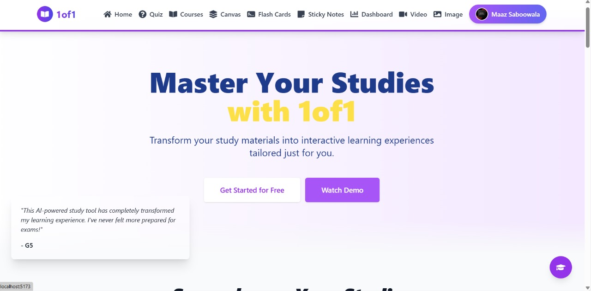
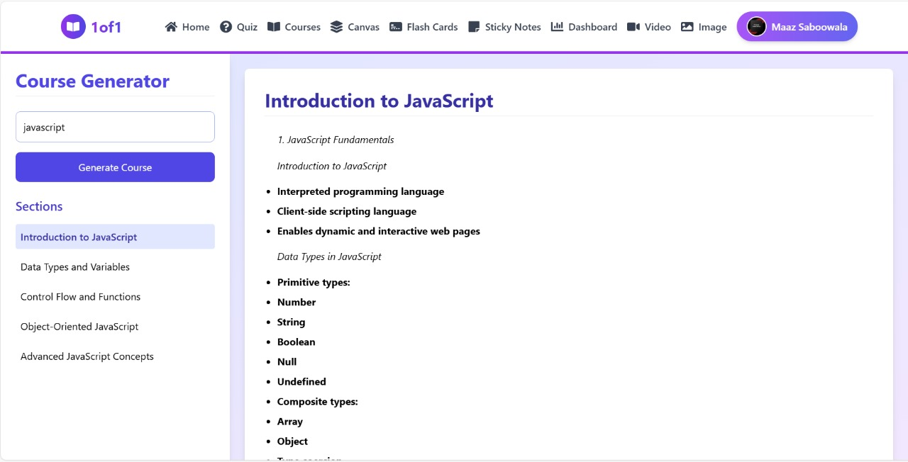
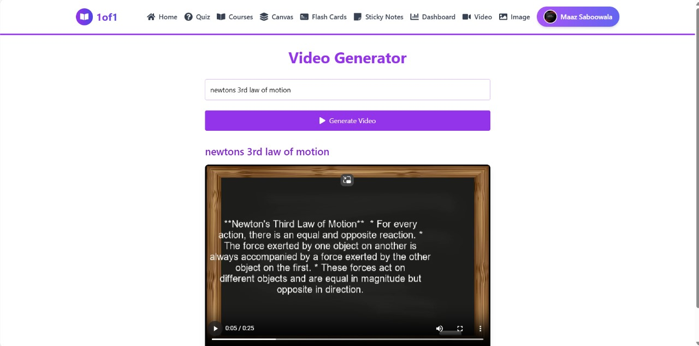
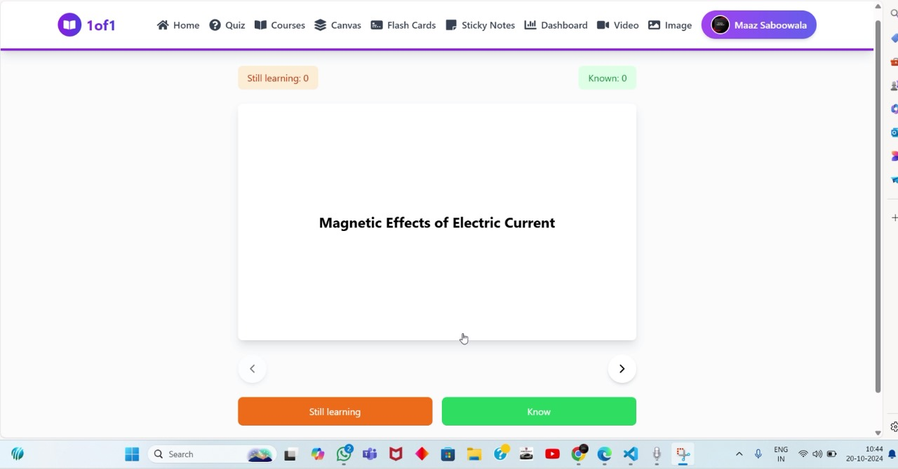
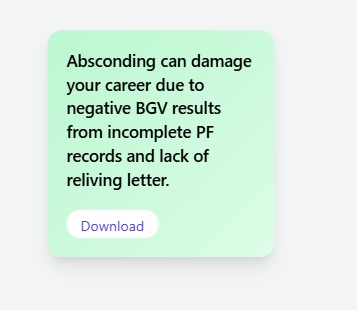
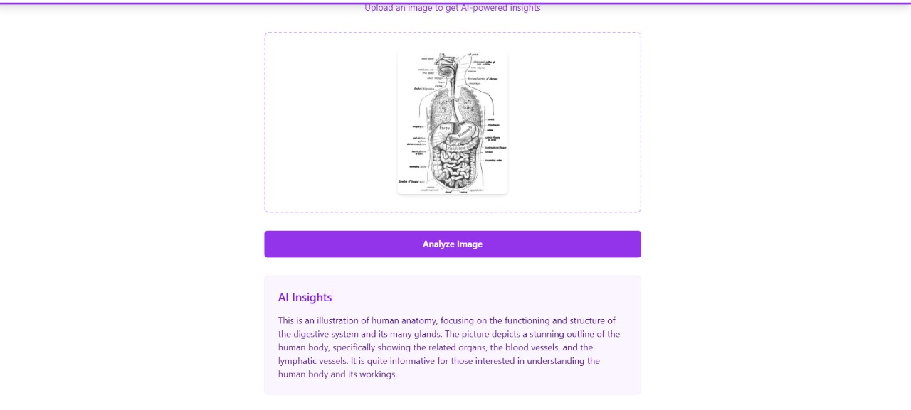

# 1of1 AI-Powered Study Assistant

Welcome to the **AI-Powered Study Assistant**, a platform designed to revolutionize learning through the use of cutting-edge AI models. This project includes a range of features, such as automated quiz generation, personalized flashcards, and interactive diagram reading, which together create a tailored learning experience.

## Demo Video

**Discover the AI-Powered Study Assistant:**
   - Experience personalized learning through our unique features.
   
    

   [Watch the Demo Video on YouTube](https://www.youtube.com/watch?v=uzgnRwm4teY)

---

## Key Features

### 1. **Login Page**
The **Login Page** offers a seamless and secure authentication process for users. Once logged in, students and educators can access personalized content tailored to their needs.

---

### 2. **Home Page**
The **Home Page** serves as the main hub for the platform, giving users access to all the available tools, courses, and study features. It provides an intuitive and user-friendly interface for easy navigation.

---

### 3. **Quiz Generation**
The platform features an advanced **Quiz Generation** tool, powered by a Retrieval-Augmented Generation (RAG) system, which creates quizzes based on uploaded documents such as PDFs, PPTs, and notes. The quizzes adapt to the learner’s performance, offering a dynamic learning experience.

---

### 4. **Dashboard (with SWOT Analysis)**
The **Dashboard** tracks user progress across quizzes, flashcards, and other study activities. It includes detailed performance analytics and integrates a **SWOT (Strengths, Weaknesses, Opportunities, Threats) Analysis** feature to help users assess their learning strengths and areas of improvement.

---

### 5. **Course Generator**
The **Course Generator** creates comprehensive summaries and personalized learning paths from study materials. It helps streamline the learning process by condensing large volumes of information into manageable summaries.

---

### 6. **Canvas (AI-Generated Videos)**
The **Canvas** feature allows users to generate **AI-powered video lectures** based on their study material. These videos are equipped with **Text-to-Speech (TTS)** capabilities to enhance the learning experience.

---

### 7. **Flashcards**
The platform automatically generates **flashcards** from uploaded documents using AI-powered summaries. The flashcards adjust in difficulty based on the user’s performance, ensuring a focused and effective study session.

---

### 8. **Sticky Notes**
The **Sticky Notes** feature allows users to create and manage bite-sized summaries of key concepts. It helps students keep track of important information in a concise and organized manner.

---

### 9. **Diagram Reader (LLaMA + Llava Models)**
Unlike typical RAG systems that only handle textual data, our platform includes a **Diagram Reader** that leverages the **LLaMA + Llava models** to read and interpret diagrams. This feature provides in-depth explanations of visual data, offering students a unique way to interact with images and diagrams.

---

## Technical Features

The **AI-Powered Study Assistant** is built using a variety of cutting-edge technologies:
- **Retrieval-Augmented Generation (RAG)** for quiz and flashcard generation.
- **LLaMA + Llava Models** for image and diagram interpretation, providing capabilities beyond typical AI study assistants.
- **Gemini API** for automated flashcard summaries.
- **Text-to-Speech (TTS)** for AI-generated video lectures.
- **Caching system** in quiz generation to improve performance and speed by storing previously generated questions.

